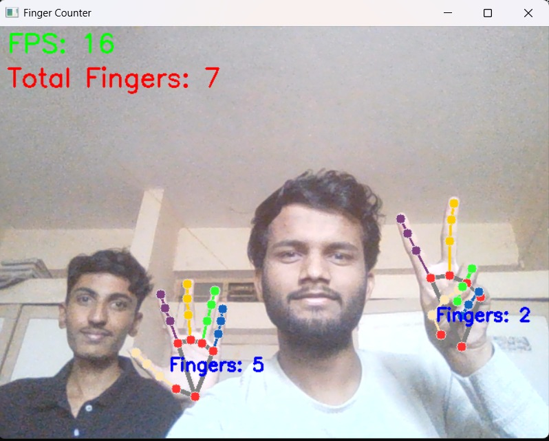

# AI-Finger-Counter 👋✌️🖐️

A real-time finger counting system built with **Python**, **MediaPipe**, and **OpenCV**. It detects hands from webcam input and counts the number of fingers being shown. This project demonstrates the power of AI-based gesture recognition and computer vision.

---

## 🚀 Features

- 📷 Real-time finger detection using your webcam
- ✋ Accurate finger counting using hand landmarks
- 🤖 AI-powered hand tracking via MediaPipe
- 🎯 Enhanced thumb detection using angle-based logic
- ⚡ Displays total fingers with FPS on screen

---

## 🧰 Tech Stack

- Python 3.10.11
- [MediaPipe](https://google.github.io/mediapipe/) by Google
- OpenCV (cv2)

---

## 🖥️ Demo Screenshot




## 🛠️ Installation & Setup

1. Make sure you have Python 3.10.11 installed
```bash
python --version
```

2. Clone this repository
```bash
git clone https://github.com/shivraj-yadav/AI-Finger-Counter.git
cd AI-Finger-Counter
```

3. Install required dependencies
```bash
pip install opencv-python
pip install mediapipe
```

4. Run the application
```bash
python finger_counter.py
```

5. Usage instructions:
   - Position your hand clearly in front of the webcam
   - Display fingers to see real-time counting
   - Press `q` to exit the application

## 📁 Project Structure

```
AI-Finger-Counter/
├── finger_counter.py    # Main application script
├── README.md            # Project documentation
└── demo-screenshot.png  # Visual demonstration of the application
```

## 📌 Use Cases

- **Education**: Teaching computer vision and AI concepts
- **HCI Research**: Exploring natural human-computer interaction methods
- **Accessibility**: Creating gesture-based control systems
- **Gaming**: Developing hand gesture-controlled games
- **Smart Home**: Implementing touchless control interfaces

## 👨‍💻 About the Author

**Shivraj Ravindra Yadav**  
📍 Solapur, Maharashtra  
🚀 AI & Machine Learning Engineer | Full-Stack Developer  
📬 [Connect on LinkedIn](https://www.linkedin.com/in/shivraj-yadav-a776aa257/)  


## ⭐ Support This Project

If you found this project useful, please consider:
- Giving it a star on GitHub
- Sharing it with others who might benefit
- Contributing to future improvements

## 📜 License

This project is licensed under the MIT License - see the [LICENSE](LICENSE) file for details.

---

*Built with ❤️ by Shivraj Yadav*
